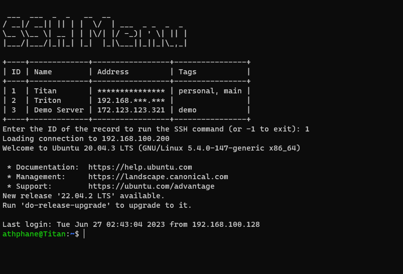

# SSHMenu



SSHMenu is a command-line tool that allows you to manage and connect to your SSH hosts conveniently. You can
add new hosts, toggle address visibility, and select hosts to establish SSH connections.

## Features

- Add new SSH hosts by providing the name, username, address, and port.
- Toggle address visibility to obfuscate or reveal the host addresses.
- Select a host from the list to establish an SSH connection.

## Prerequisites

- Python 3.x
- pip package manager

## Installation

1. Clone the repository:

```shell
git clone https://github.com/athphane/sshmenu.git
```

2. Navigate to the project directory

```shell
cd sshmenu
```

3. Install the required dependencies

```shell
pip install -r requirements.txt
```

## Usage

To run the SSH Host Management tool, use the following command:

```shell
python main.py [--add] [--toggle] [--filter TAG]
```

- `--add`: Add a new host interactively.
- `--toggle`: Toggle address visibility for a host.
- `--filter TAG`: Filter hosts by the specified tag.

Note: If no options are provided, the tool will display a list of hosts for selection.

## The hosts.json file

The script will look for the hosts.json file in a "sensible default" location, which is the user's SSH config folder.
Here's the full path to it: `~/.ssh/hosts.json`

## Configuration

The hosts are stored in a JSON file named `hosts.json`. You can manually edit this file to add or modify hosts.

Each host object should have the following attributes:

- `name`: The name of the host.
- `username`: The SSH username for the host.
- `address`: The IP address or hostname of the host.
- `port`: The SSH port number for the host.
- `tags` (optional): A list of tags associated with the host.

Here's an example of the JSON structure:

```json
{
  "hosts": [
    {
      "name": "Example Host",
      "username": "user",
      "address": "192.168.0.1",
      "port": 22,
      "tags": [
        "tag1",
        "tag2"
      ]
    },
    ...
  ]
}
```

## Examples

1. Add a new host:

```shell
python main.py --add
```

2. Toggle address visibility for a host

```shell
python main.py --toggle
```

3. Filter hosts by a tag

```shell
python main.py --filter tag1
```

## Building the Executable with PyInstaller

PyInstaller is a popular tool for creating standalone executables from Python applications.
Follow the steps below to build the executable for SSHMenu.

1. Run the helper script to do it automatically

```shell
.\build.bat
```

This will run the script, activate your virtual environment and compiles an EXE of SSHMenu.

The compiled EXE will be in the [/dist](dist) folder of the project. You can move it to a different folder in your
system, or to a folder that is added to your PATH, which will let you use the exe from anywhere on your system.

## Contributing

Contributions are welcome! If you find any issues or have suggestions for improvements, feel free to open an issue or
submit a pull request.

## Credits

- [Athfan Khaleel](https://github.com/athphane)
- [All Contributors](../../contributors)

## License

This project is licensed under the MIT License